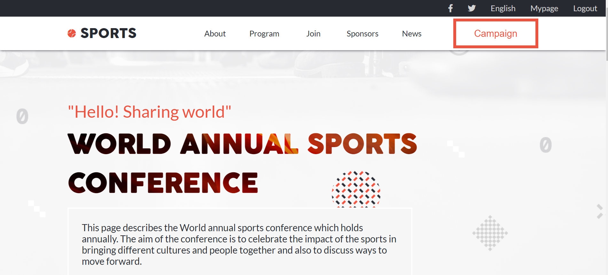
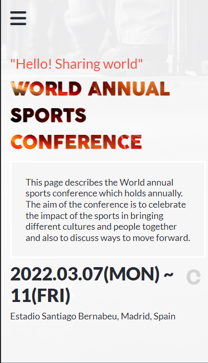

# Sports Conference Capstone Project

> This project satisfies the requirements of microverse module1 capstone project. It' describes an annual sports conference


## Built With

- HTML/CSS and JavaScript
- Git and GitHub

## [Live Demo](https://d2ndjim.github.io/Capstone-Conference/)




To get a local copy up and running follow these simple example steps.

### Prerequisites

The basic requirements for building the executable are:

- A working browser application (Google chrome, Mozilla Fire fox, Microsoft edge ...)
- VSCode or any other equivalent code editor
- Node Package Manager (For installing packages like Lighthous, webhint & stylelint used for checking for debugging bad codes before deployment)

# Getting Started

#### Cloning the project

```
git clone  <https://github.com/d2ndjim/Capstone-Conference.git>
```

## Getting started with Webpack


## Getting packages and debuging with Stylelint

```
npm install --save-dev stylelint@13.x stylelint-scss@3.x stylelint-config-standard@21.x stylelint-csstree-validator@1.x
```

##### For validation detection using Stylelint Run

```
npx stylelint "**/*.{css,scss}"
```

##### from parent source directory

## Getting packages and debuging with ESlint

```
npm install npm install --save-dev eslint@7.x eslint-config-airbnb-base@14.x eslint-plugin-import@2.x babel-eslint@10.x
```

##### For validation detection using Stylelint Run

```
npx eslint .
```

##### from parent source directory

## Getting packages and debuging with Webhint

```
npm init -y
npm install --save-dev hint@6.x
```

##### For validation detection using Webhint, Run

```
npx hint .
```

## Authors

👤 **Lekan Jimoh**

- GitHub: [@d2ndjim](https://github.com/d2ndjim)
- Twitter: [@d2ndjim](https://twitter.com/d2ndjim_)
- LinkedIn: [Lekan Jimoh](https://linkedin.com/in/lekanj)
## 🤝 Contributing
Contributions, issues, and feature requests are welcome!

Feel free to check the [issues page](../../issues/).

## Show your support

Give a ⭐️ if you like this project!

## Acknowledgments

- Hat tip to Cindy Shin whose design was used to create the project
- Hat tip to @microverseinc for putting this project together
## 📝 License

This project is [MIT](./MIT.md) licensed.
